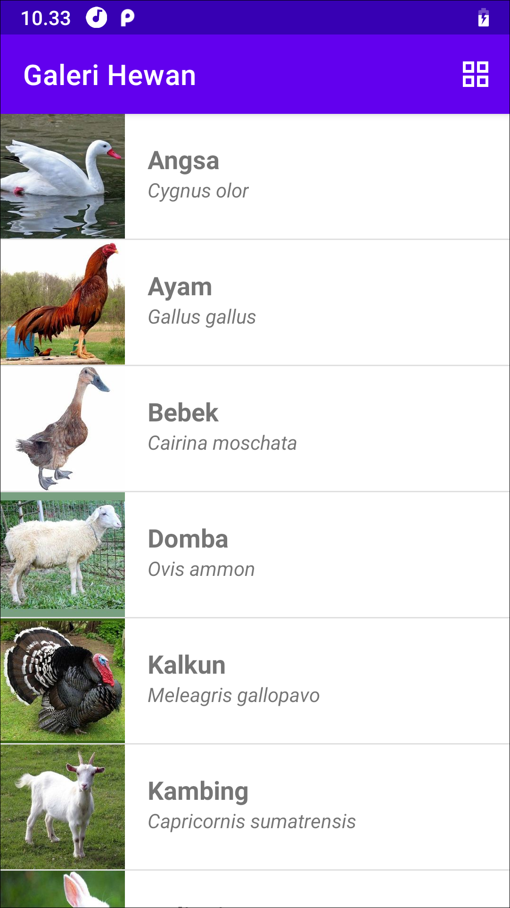

# Galeri Hewan

Aplikasi Android sederhana yang menampilkan list hewan menggunakan RecyclerView. Terdapat dua pilihan tampilan, yaitu list atau grid. Pengguna dapat berpindah dari satu tampilan ke tampilan lainnya dengan klik action menu di kanan atas. Pilihan tampilan ini selanjutnya disimpan menggunakan Preferences DataStore agar ketika pengguna masuk ke aplikasi lagi, tampilan tetap sesuai pilihan terakhirnya.

Punya pertanyaan atau masukan? Silahkan disampaikan melalui issue repository ini.

## Lisensi

    Copyright (c) 2021-2023 Indra Azimi. All rights reserved.

    Dibuat untuk kelas Pemrograman untuk Perangkat Bergerak 1.
    Dilarang melakukan penggandaan dan atau komersialisasi,
    sebagian atau seluruh bagian, baik cetak maupun elektronik
    terhadap project ini tanpa izin pemilik hak cipta.